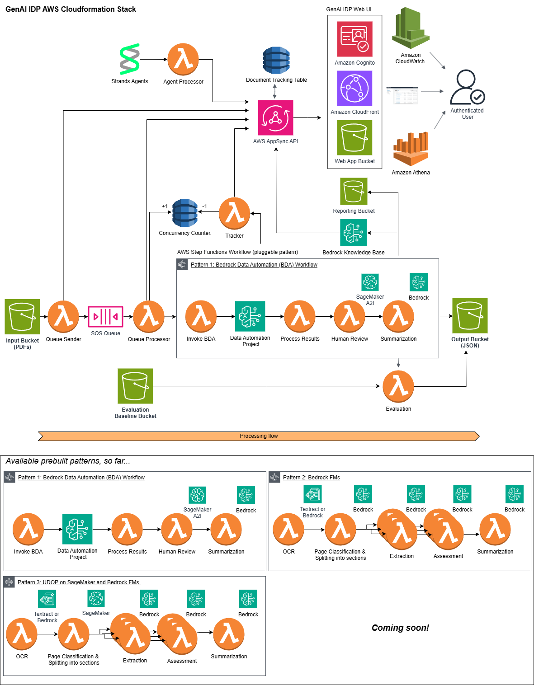

# GenAIIDP Architecture

## Flow Overview

1. Documents uploaded to Input S3 bucket trigger EventBridge events
2. Queue Sender Lambda records event in tracking table and sends to SQS
3. Queue Processor Lambda:
   - Picks up messages in batches
   - Manages workflow concurrency using DynamoDB counter
   - Starts Step Functions executions
4. Step Functions workflow runs the steps defined in the selected pattern to process the document and generate output in the Output S3 bucket
5. Workflow completion events update tracking and metrics



## Components

- **Storage**: S3 buckets for input documents and JSON output
- **Message Queue**: Standard SQS queue for high throughput
- **Functions**: Lambda functions for queue operations
- **Step Functions**: Document processing workflow orchestration
- **DynamoDB**: Tracking and concurrency management
- **CloudWatch**: Comprehensive monitoring and logging

## Modular Design Overview

The solution uses a modular architecture with nested CloudFormation stacks to support multiple document processing patterns while maintaining a common infrastructure for queueing, tracking, and monitoring. This design enables:

- Support for multiple processing patterns without duplicating core infrastructure
- Easy addition of new processing patterns without modifying existing code
- Centralized monitoring and management across all patterns
- Pattern-specific optimizations and configurations

## Stack Structure

### Main Stack (template.yaml)

The main template handles all pattern-agnostic resources and infrastructure:

- S3 Buckets (Input, Output)
- SQS Queues and Dead Letter Queues
- DynamoDB Tables (Execution Tracking, Concurrency)
- Lambda Functions for:
  - Queue Processing
  - Queue Sending
  - Workflow Tracking
  - Document Status Lookup
- CloudWatch Alarms and Dashboard
- SNS Topics for Alerts

### Pattern Stacks (patterns/*)

Each pattern is implemented as a nested stack that contains pattern-specific resources:

- Step Functions State Machine
- Pattern-specific Lambda Functions:
  - OCR Processing
  - Classification
  - Extraction
- Pattern-specific CloudWatch Dashboard
- Model Endpoints and Configurations

## Current Patterns

### Pattern 1: Bedrock Data Automation (BDA)
Packet or Media processing with Bedrock Data Automation (BDA)


### Pattern 2: Textract + Bedrock
OCR → Bedrock Classification (page-level or holistic) → Bedrock Extraction


### Pattern 3: Textract + UDOP + Bedrock
OCR → UDOP Classification (SageMaker) → Bedrock Extraction


## Pattern Selection and Deployment

The pattern is selected at deployment time using the `IDPPattern` parameter:

```yaml
IDPPattern:
  Type: String
  Default: Pattern2
  AllowedValues:
    - Pattern1  # Bedrock Data Automation (BDA)
    - Pattern2  # Textract + Bedrock (page-level or holistic classification)
    - Pattern3  # Textract + SageMaker UDOP + Bedrock
  Description: Choose from built-in IDP workflow patterns
```

When deployed, the main stack uses conditions to create the appropriate nested stack:

```yaml
Conditions:
  IsPattern1: !Equals [!Ref IDPPattern, "Pattern1"]
  IsPattern2: !Equals [!Ref IDPPattern, "Pattern2"]
  IsPattern3: !Equals [!Ref IDPPattern, "Pattern3"]

Resources:
  PATTERN1STACK:
    Type: AWS::CloudFormation::Stack
    Condition: IsPattern1
    Properties:
      TemplateURL: ./patterns/pattern-1/.aws-sam/packaged.yaml
      Parameters:
        # Pattern-specific parameters...
```

## Integrated Monitoring

The solution creates an integrated CloudWatch dashboard that combines metrics from both the main stack and the selected pattern stack:

1. The main stack creates a dashboard with core metrics:
   - Queue performance
   - Overall workflow statistics
   - General error tracking
   - Resource utilization

2. Each pattern stack creates its own dashboard with pattern-specific metrics:
   - OCR performance
   - Classification accuracy
   - Extraction stats
   - Model-specific metrics

3. The `DashboardMerger` Lambda function combines these dashboards

## Adding New Patterns

To add a new processing pattern:

1. Create a new directory under `patterns/`
2. Implement the pattern-specific resources in a CloudFormation template
3. Add the pattern to the `IDPPattern` parameter's allowed values
4. Add pattern-specific parameters to the main template
5. Create a new condition and nested stack resource for the pattern

The new pattern will automatically inherit all the core infrastructure and monitoring capabilities while maintaining its own specific processing logic and metrics.
