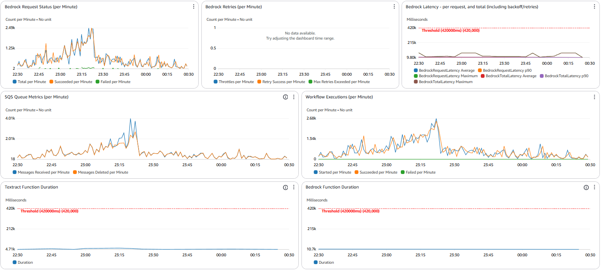
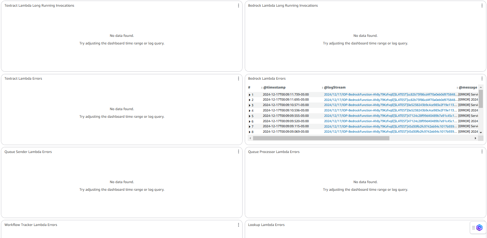

# Monitoring and Logging

The GenAIIDP solution provides comprehensive monitoring through Amazon CloudWatch to give you visibility into the document processing pipeline.

## CloudWatch Dashboard

The solution automatically creates an integrated dashboard that displays:

### Latency Metrics

- **End-to-End Processing Time**: Total time from document upload to completion
- **Step Function Execution Duration**: Time spent in workflow orchestration
- **Lambda Function Latency**: Processing time per function (OCR, Classification, Extraction)
- **Queue Wait Time**: Time documents spend in processing queues
- **Model Inference Time**: Bedrock model response latencies


### Throughput Metrics

- **Documents Processed per Hour**: Overall system throughput
- **Pages Processed per Minute**: OCR processing rate
- **Classification Requests per Second**: Page classification throughput
- **Extraction Completions per Hour**: Field extraction processing rate
- **Queue Message Rate**: SQS message processing velocity



### Error Tracking

- **Workflow Failures**: Step Function execution failures with error categorization
- **Lambda Timeouts**: Function timeout events and duration analysis
- **Model Throttling**: Bedrock throttling events and retry patterns
- **Dead Letter Queue Messages**: Failed messages requiring manual intervention
- **Validation Errors**: Data validation failures and format issues



## Log Groups

The solution creates centralized logging across all components:

- `/aws/stepfunctions/IDPWorkflow`: Step Function execution logs
- `/aws/lambda/QueueProcessor`: Document queue processing logs
- `/aws/lambda/OCRFunction`: OCR processing logs and errors
- `/aws/lambda/ClassificationFunction`: Classification processing logs
- `/aws/lambda/ExtractionFunction`: Extraction processing logs
- `/aws/lambda/TrackingFunction`: Document tracking and status logs
- `/aws/appsync/GraphQLAPI`: Web UI API access logs

All logs include correlation IDs for tracing individual document processing journeys.

## Pattern-Specific Monitoring

Each pattern includes additional monitoring tailored to its specific workflow:

### Pattern 1: Bedrock Data Automation (BDA)
- BDA project execution metrics
- API usage and throttling
- Media processor performance

### Pattern 2: Textract + Bedrock
- Textract OCR performance
- Bedrock model usage
- Classification confidence distribution
- Extraction completeness metrics

### Pattern 3: Textract + UDOP + Bedrock
- SageMaker endpoint performance
- UDOP model latency and throughput
- GPU utilization metrics

## Setting Up Alerts

You can configure CloudWatch alarms for critical metrics:

1. **Error Rate Thresholds**: Alert when error rates exceed acceptable levels
2. **Processing Time Anomalies**: Detect unusual latency spikes
3. **Queue Depth Monitoring**: Alert on potential backlogs
4. **Concurrency Limits**: Notify when approaching service limits
5. **Cost Controls**: Alert on unusual model usage patterns

Example alarm configuration:

```yaml
ErrorRateAlarm:
  Type: AWS::CloudWatch::Alarm
  Properties:
    AlarmDescription: Alert when error rate exceeds 5%
    MetricName: DocumentProcessingErrors
    Namespace: AWS/Lambda
    Statistic: Sum
    Period: 300
    EvaluationPeriods: 1
    Threshold: 5
    ComparisonOperator: GreaterThanThreshold
    TreatMissingData: notBreaching
    AlarmActions:
      - !Ref AlertSNSTopic
```

## Log Insights Queries

The solution includes predefined CloudWatch Log Insights queries for common analysis tasks:

### Error Analysis

```
filter @message like /ERROR/ or @message like /Exception/
| parse @message "Error: *" as errorMessage
| stats count(*) as errorCount by errorMessage
| sort by errorCount desc
| limit 10
```

### Processing Time Analysis

```
filter @message like /Processing complete/
| parse @message "Processing complete in * ms" as processingTime
| stats avg(processingTime) as avgTime, min(processingTime) as minTime, max(processingTime) as maxTime by bin(30m)
| sort by avgTime desc
```

### Document Volume Tracking

```
filter @message like /Document received/
| stats count(*) as documentCount by bin(1h)
| sort by bin(1h) asc
```

## Metric Dimensions

Key metrics are available with these dimensions:

- **DocumentType**: Break down metrics by document class
- **ProcessingPattern**: Compare metrics across different patterns
- **PageCount**: Analyze performance based on document complexity
- **Region**: Track regional performance differences

## Performance Benchmarks

The dashboard includes performance benchmark comparisons:

- **Current vs. Historical Performance**: Compare current metrics against previous periods
- **Pattern Comparison**: Side-by-side comparison of different processing patterns
- **Model Performance**: Comparison of different Bedrock models for similar tasks

## Operational Monitoring

The solution provides operational metrics for infrastructure health:

- **Lambda Concurrency**: Track function concurrency usage
- **Throttling Events**: Monitor service limits and throttling
- **DynamoDB Capacity**: Track consumed read/write capacity units
- **S3 Request Rates**: Monitor bucket operation rates and latency
- **Step Functions Execution Metrics**: Track state transitions and execution counts

## Cost Monitoring

Monitor resource usage and costs:

- **Bedrock Model Tokens**: Track token usage by model and operation
- **Lambda Execution Time**: Monitor function duration and memory usage
- **S3 Storage**: Track storage growth over time
- **Data Transfer**: Monitor network costs between services

## Custom Dashboard Creation

You can create custom dashboards focused on specific aspects:

1. Open the CloudWatch console
2. Go to Dashboards and select "Create dashboard"
3. Add widgets using metrics from the "GenAIIDP" namespace
4. Organize widgets logically by processing stage or metric type

## Exporting Metrics

To export metrics for external analysis:

1. Use CloudWatch Metric Streams to send metrics to:
   - Amazon Kinesis Data Firehose
   - Third-party monitoring tools
   - Custom analytics solutions

2. Configure the stream with:
   - Metrics namespace filters
   - Output format (JSON or OpenTelemetry)
   - Destination configuration
